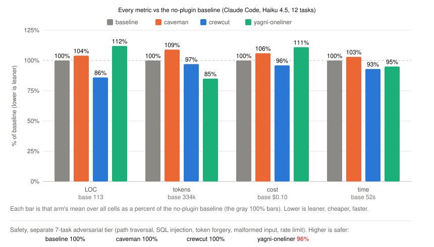

# crewcut

[](https://github.com/kaveraa/crewcut/actions/workflows/tests.yml)

[English](https://github.com/kaveraa/crewcut/blob/main/README.md) - **Français**

Cheveux courts, code court. Un plugin Claude Code pour le code le plus simple
qui marche : moins de code sur chaque dépôt et chaque modèle mesurés, moins
de tokens là où il y a quelque chose à ne pas lire ou à ne pas écrire, des
réponses courtes, et aucune coupe sur la sécurité.

## Benchmark agentique

Crewcut passé au benchmark que ponytail a publié pour lui-même : douze
tickets d'une ligne sur un vrai dépôt FastAPI + React, une session Claude
Code headless par cellule, notée sur le `git diff` qu'elle laisse, avec les
mêmes contrôles (caveman pour la prose concise, le prompt YAGNI de sept mots)
et sept tâches de sécurité dont la sortie est exécutée sur des entrées
hostiles. Haiku 4.5, quatre runs par cellule, 2026-10-02.

<p align="center"></p>

**full-stack-fastapi-template** (le dépôt et les tickets de ponytail) :

| vs baseline sans plugin | lignes | tokens | coût | temps | sûr |
|---|--:|--:|--:|--:|--:|
| **crewcut** | **-14 %** | **-3 %** | **-4 %** | **-7 %** | **100 %** |
| caveman (contrôle prose concise) | +4 % | +9 % | +6 % | +3 % | 100 % |
| prompt "YAGNI + one-liners" | +12 % | -15 % | +11 % | -5 % | 96 % |

**Next-js-Boilerplate** (même protocole, second dépôt) :

| vs baseline sans plugin | lignes | tokens | coût | temps | sûr |
|---|--:|--:|--:|--:|--:|
| **crewcut** | **-40 %** | **-10 %** | **-13 %** | **-20 %** | **100 %** |
| caveman (contrôle prose concise) | -15 % | +16 % | +8 % | -4 % | 100 % |
| prompt "YAGNI + one-liners" | -29 % | -23 % | -7 % | -23 % | 96 % |

**Sonnet 5.5** (même template et mêmes tickets, trois bras, trois runs) :

| vs baseline sans plugin | lignes | tokens | coût | temps | sûr |
|---|--:|--:|--:|--:|--:|
| **crewcut** | **-8 %** | **+9 %** | **+2 %** | **-2 %** | **100 %** |
| prompt "YAGNI + one-liners" | -31 % | -1 % | -12 % | -14 % | 100 % |

Crewcut 0.5.1, remesuré sur le palier Sonnet après la règle "build the
ticket only", bras crewcut seul : lignes -20 %, tokens +7 %, coût 0 %,
temps -7 %. Crewcut 0.6.0, avec un ruleset relu à chaque tour réduit
d'environ 695 à 580 tokens : lignes -15 %, tokens -5 %, coût -15 %,
temps -6 %, sûr 21/21. Sur Sonnet, crewcut consomme désormais moins de tokens
que la baseline. Crewcut 0.6.3, six runs par ticket : lignes -13 %, tokens
0 %, coût -11 %, temps 0 % ; deux tirages de trois runs ont donné -10 % et
-17 % de lignes, ce qui est la bande de bruit sur ce palier.

**Opus 5.5** (même template et mêmes tickets, trois bras, trois runs, crewcut 0.5.3) :

| vs baseline sans plugin | lignes | tokens | coût | temps | sûr |
|---|--:|--:|--:|--:|--:|
| **crewcut** | **-70 %** | **-40 %** | **-43 %** | **-49 %** | **100 %** |
| prompt "YAGNI + one-liners" | -72 % | -44 % | -49 % | -56 % | 100 % |

Crewcut 0.6.1 sur le palier Opus, bras crewcut seul : lignes -68 %, tokens
-39 %, coût -41 %, temps -45 %, sûr 21/21, comme la 0.5.3 au bruit près.

**Opus 5.5 sur Next-js-Boilerplate** (mêmes tickets que plus haut, trois bras, trois runs, crewcut 0.6.1) :

| vs baseline sans plugin | lignes | tokens | coût | temps | sûr |
|---|--:|--:|--:|--:|--:|
| **crewcut** | **-82 %** | **-55 %** | **-60 %** | **-67 %** | **100 %** |
| prompt "YAGNI + one-liners" | -88 % | -62 % | -66 % | -72 % | 100 % |

Chaque case est la moyenne du bras sur toutes les cellules, en pourcentage
de la baseline sans plugin, la même lecture que le graphique. Crewcut coupe
des lignes sur chaque dépôt et chaque modèle mesurés et ne retire jamais un
garde-fou. La coupe est la plus forte quand un élément natif remplace un
composant (sélecteur de couleur -67 % sur le template, -58 % sur le
boilerplate ; sélecteur de date -39 % et -55 %) et proche de zéro sur les
endpoints irréductibles. La marge suit la baseline : celle de Next.js
sur-construit davantage, crewcut passe donc dessous sur onze tickets sur
douze ; celle de Sonnet est déjà sobre, crewcut n'y retire que 8 % des lignes
et le prompt de sept mots, qui saute les tests, en retire plus ; celle
d'Opus sur-construit le plus (un sélecteur de date de 369 lignes avec deux
nouvelles dépendances contre l'input natif de 10 lignes de crewcut), crewcut
y coupe donc 70 % des lignes. Les tokens ne baissent que là où le plugin
retire des tours : sur Opus ils passent de 12,1 à 7,5 par ticket et la
facture baisse de 43 % ; sur un petit dépôt avec un modèle qui ne
sur-construit pas, le ruleset est relu à chaque tour, donc sa taille est le
coût : la 0.6.0 l'a réduit d'un sixième et Sonnet est passé de +7 % à -5 %
en tokens.
Méthode, tableaux par tâche, limites et reproduction :
[benchmarks/agentic/RESULTS.md](benchmarks/agentic/RESULTS.md) (en anglais).
Cinq de ces cellules avec le diff et la réponse de chaque bras, tels quels :
[examples/](examples/) (en anglais).

## Mesuré

Trois mesures des mêmes sept cas, trois runs chacun, avec et sans le plugin,
Sonnet comme juge
(`claude plugin eval . --ablation with-without --runs 3 --judge-model sonnet`,
avec `--allow-tools Edit Write`), sur trois modèles de travail. Le score est
la part des graders passés. À modèle fixe, le coût tient lieu de tokens.

### Fable 5.1 (crewcut 0.4.0, 2026-10-02, Claude Code 2.1.287)

| Cas             | Score avec | Score sans | Coût par run avec | Coût par run sans | Tours avec | Tours sans |
| --------------- | ---------- | ---------- | ----------------- | ----------------- | ---------- | ---------- |
| date-picker     | 0,83       | 0,83       | 0,092 USD         | 0,070 USD         | 4,0        | 3,0        |
| url-parse       | 0,95       | 0,86       | 0,086 USD         | 0,072 USD         | 3,3        | 3,7        |
| shared-bug      | 1,00       | 0,63       | 0,105 USD         | 0,090 USD         | 5,0        | 6,0        |
| keep-validation | 0,94       | 0,72       | 0,119 USD         | 0,130 USD         | 4,7        | 4,0        |
| explain-bug     | 0,92       | 0,92       | 0,092 USD         | 0,079 USD         | 4,7        | 4,7        |
| vat-country     | 1,00       | 1,00       | 0,106 USD         | 0,160 USD         | 5,0        | 7,7        |
| csv-export      | 1,00       | 0,78       | 0,116 USD         | 0,133 USD         | 7,0        | 11,3       |
| tous            | 0,95       | 0,82       | 0,102 USD         | 0,105 USD         | 4,8        | 5,8        |

### Sonnet 5.5 (crewcut 0.3.3, 2026-10-01, Claude Code 2.1.287)

| Cas             | Score avec | Score sans | Coût par run avec | Coût par run sans | Tours avec | Tours sans |
| --------------- | ---------- | ---------- | ----------------- | ----------------- | ---------- | ---------- |
| date-picker     | 0,83       | 0,83       | 0,052 USD         | 0,044 USD         | 4,3        | 4,0        |
| url-parse       | 0,90       | 0,90       | 0,060 USD         | 0,055 USD         | 4,0        | 4,0        |
| shared-bug      | 0,62       | 0,62       | 0,050 USD         | 0,049 USD         | 3,0        | 6,0        |
| keep-validation | 0,89       | 0,89       | 0,095 USD         | 0,110 USD         | 4,0        | 4,3        |
| explain-bug     | 0,92       | 0,92       | 0,051 USD         | 0,047 USD         | 4,0        | 4,0        |
| vat-country     | 1,00       | 1,00       | 0,072 USD         | 0,074 USD         | 8,7        | 9,7        |
| csv-export      | 1,00       | 0,89       | 0,063 USD         | 0,088 USD         | 7,0        | 11,0       |
| tous            | 0,88       | 0,87       | 0,063 USD         | 0,067 USD         | 5,0        | 6,1        |

### Opus 5.5 (crewcut 0.5.2, 2026-10-03, Claude Code 2.1.287)

| Cas             | Score avec | Score sans | Coût par run avec | Coût par run sans | Tours avec | Tours sans |
| --------------- | ---------- | ---------- | ----------------- | ----------------- | ---------- | ---------- |
| date-picker     | 0,83       | 0,83       | 0,101 USD         | 0,081 USD         | 4,0        | 3,0        |
| url-parse       | 0,86       | 0,86       | 0,097 USD         | 0,075 USD         | 4,0        | 3,3        |
| shared-bug      | 1,00       | 0,62       | 0,098 USD         | 0,088 USD         | 4,0        | 5,3        |
| keep-validation | 1,00       | 0,89       | 0,144 USD         | 0,117 USD         | 5,3        | 4,7        |
| explain-bug     | 0,75       | 0,92       | 0,093 USD         | 0,091 USD         | 4,3        | 5,0        |
| vat-country     | 1,00       | 1,00       | 0,120 USD         | 0,122 USD         | 6,3        | 8,0        |
| csv-export      | 0,96       | 0,78       | 0,135 USD         | 0,141 USD         | 7,3        | 13,0       |
| tous            | 0,91       | 0,84       | 0,113 USD         | 0,102 USD         | 5,0        | 6,0        |

Remesuré avec crewcut 0.6.0 (2026-10-03, Claude Code 2.1.288) : score 0,95
contre 0,83, tours 5,3 contre 5,9, coût par run 0,107 contre 0,099 USD ;
`explain-bug` 1,00 contre 0,83. Remesuré avec crewcut 0.6.1 : score 1,00 sur
chaque cas contre 0,84 sans, tours 5,0 contre 5,7, coût par run 0,106 contre
0,100 USD. Avec crewcut 0.6.3 et les graders de `date-picker` refaits (plus
bas) : 0,98 contre 0,83, tours 5,2 contre 5,9, coût par run 0,101 contre
0,099 USD ; `date-picker` 0,86 dans les deux bras.

Crewcut 0.6.1 sur les deux autres modèles (2026-10-03, Claude Code
2.1.288) : Fable 5.1 obtient 0,96 contre 0,81, en 6,2 tours contre 9,0, à
0,309 contre 0,404 USD par run (-24 %) ; Sonnet 5.5 obtient 0,97 contre
0,89, en 5,7 tours contre 6,3, à 0,066 contre 0,062 USD (+6 %). Sonnet avec
crewcut 0.6.3 : 0,96 contre 0,88, 5,4 tours contre 6,0, 0,061 contre
0,062 USD. Fable avec crewcut 0.6.3 (2026-10-03, Claude Code 2.1.287,
42 cellules propres) : 0,97 contre 0,82, 6,5 tours contre 9,1 (-29 %),
0,296 contre 0,378 USD (-22 %) ; `csv-export` lit 3,3 fichiers contre 9,0,
`vat-country` 3,0 contre 11,0, et `date-picker` passe 3 runs sur 3 avec le
plugin contre 0 sans. Les runs de Fable coûtent environ trois fois la
mesure 0.4.0 dans les deux bras, seul le rapport se compare. Avec crewcut
0.6.5 et la règle de sortie à une seule mise en garde (2026-10-04, Claude
Code 2.1.289) : Sonnet 0,98 contre 0,86, 5,4 tours contre 6,1, 0,064 contre
0,066 USD (-3 %) ; Opus 0,98 contre 0,83, 5,1 tours contre 6,0, 0,104 contre
0,102 USD (+2 %) ; `date-picker` passe 3 runs sur 3 avec le plugin sur les
deux, contre 0 sans.

Ce que ça dit :

- L'économie apparaît avec la taille du projet. `csv-export` fait vingt
  fichiers de source et de tests avec un bug d'une ligne : avec le plugin,
  Fable lit 2,3 fichiers contre 5,3 et prend 7 tours contre 11,3, Sonnet lit
  3,0 contre 4,7 et prend 7 contre 11, Opus lit 2,0 contre 6,3 et prend 7,3
  contre 13 ; le coût est 13 %, 28 % et 4 % plus bas, et le score est plus
  haut parce que chaque run sans plugin a lu plus de fichiers que le cas ne
  l'autorise. `vat-country`, sept modules, se place entre les deux : moins
  de fichiers lus, moins de tours, coût 34 % plus bas sur Fable et égal sur
  Sonnet et Opus. Les cinq cas d'un seul fichier n'ont rien à couper, et le
  ruleset y est un coût fixe : quelques pour cent de plus par run sur
  Sonnet, 15 à 30 % de plus sur Fable et Opus, score égal ou meilleur.
- Les tours baissent de 17 % sur Fable et Opus et de 18 % sur Sonnet. La
  qualité tient ou monte : 0,95 contre 0,82 sur Fable, 0,88 contre 0,87 sur
  Sonnet, 0,91 contre 0,84 sur Opus. Le coût par run sur toute la suite est
  3 % et 6 % plus bas sur Fable et Sonnet, 11 % plus haut sur Opus, où les
  cas d'un seul fichier pèsent plus.
- La règle de la cause racine dépend du modèle. Sur Fable et Opus,
  `shared-bug` est corrigé dans la fonction partagée 3 runs sur 3 avec le
  plugin contre 0 sans ; sur Sonnet, tous les runs ont patché l'appelant, au
  motif que les deux autres appelants passent déjà des nombres. Depuis la
  0.6.1, la règle dit "même si les autres appelants semblent sûrs", et
  Sonnet corrige la fonction partagée 3 runs sur 3 avec le plugin, 0 sans.
  `keep-validation` montre le même schéma : sur Fable et Opus, les runs sans
  plugin ont retiré une vérification ou surestimé ce qu'ils gardaient.
- Des échecs honnêtes, avec ou sans plugin, sur les trois modèles : sur
  `date-picker` et `url-parse`, la réponse reste plus longue que ce que la
  règle de sortie demande. Sur Opus avec le plugin, `explain-bug` perd un
  grader 3 runs sur 3 : l'explication est complète, mais elle ne dit plus où
  irait le correctif, ce que le cas demande. La règle de sortie a coupé une
  phrase dont la question avait besoin. Corrigé en 0.6.0 : une question
  reçoit une réponse complète, y compris où irait le correctif, et le cas
  passe 3 runs sur 3. `date-picker` et `url-parse` passent en 0.6.1 sur Opus
  depuis que la règle de sortie interdit de recoller le code écrit et
  n'autorise qu'une mise en garde. En 0.6.1, `url-parse` passe sur Sonnet et
  2 runs sur 3 sur Fable, `date-picker` passe sur Fable ; sur Sonnet,
  `date-picker` échouait dans les deux bras, et les réponses disaient
  pourquoi : un attribut `max` à la date du jour que personne n'avait
  demandé, puis deux mises en garde à son sujet. La 0.6.3 ajoute "no
  unasked max or min" à la règle du ticket et "in one sentence, no bullet
  list" à celle de la mise en garde, et sépare le grader : une regex vérifie
  le fichier (`max`, `min`, `pattern`, `placeholder` ; elle passe 3 runs sur
  3 dans les deux bras sur Sonnet et Opus), et le juge de réponse courte ne
  mesure plus que le message : 8 lignes au plus, pas de puces, deux phrases
  de mise en garde au plus. Ce dernier critère échouait encore dans les deux
  bras sur les deux modèles : les modèles disaient ce qu'ils n'avaient pas
  vérifié et demandaient si le champ doit être obligatoire, trois phrases là
  où la règle en demande une. La 0.6.5 a d'abord réécrit le critère en
  éléments comptables (quatre phrases au plus, aucune proposition de script
  ni d'autre changement du formulaire), et le bras avec plugin restait à 0,90
  sur chaque modèle : les manques étaient une ligne `skipped: min/max` et une
  phrase disant qu'aucun min ni max n'avait été ajouté, lues toutes deux
  comme des propositions. Elle a ensuite réécrit la règle de sortie : trois phrases au plus, une seule mise en garde et
  seulement si elle change ce que l'utilisateur fait ensuite, aucune
  proposition ni ligne skipped pour ce que le ticket n'a pas demandé.
  `date-picker` passe désormais 3 runs sur 3 avec le plugin sur Sonnet et
  Opus, 0 sans. Sur `url-parse`, le bras avec plugin répondait en trois
  phrases, mais "je ne l'ai pas exécuté" plus "une URL invalide lève une
  exception" comptaient pour deux remarques là où le juge n'en admet qu'une.
  Dire que le code n'a pas été exécuté est ce que Claude Code demande sans
  shell : le critère ne le compte plus comme la remarque. Remesure sur ce
  seul cas : 3 runs sur 3 avec le plugin sur Sonnet et Opus ; sans, 1 sur
  Sonnet (deux mises en garde, ou les trois liens) et 0 sur Opus (bloc de
  code, puces).

Chaque cas note la justesse autant que la taille : une réponse plus courte
mais fausse vaut zéro. `keep-validation` demande de simplifier un handler à
une frontière de confiance et échoue si une vérification disparaît ;
`explain-bug` pose une question et échoue si l'explication est tronquée ;
`vat-country` et `csv-export` échouent si un test existant ou un module non
concerné change.

## L'échelle

Claude prend le barreau le plus bas qui tient :

1. Doit-il exister ? Sinon, on le saute et on le dit en une ligne.
2. Déjà dans ce code ? On le réutilise.
3. La bibliothèque standard le fait ? On l'utilise.
4. La plateforme le fait nativement (HTML, CSS, SQL, OS) ? On l'utilise.
5. Une dépendance installée le fait ? On l'utilise. Jamais en ajouter une
   pour ce que quelques lignes font.
6. Une ligne ? Une ligne.
7. Seulement ensuite : le minimum qui marche.

Corriger un bug, c'est corriger la cause : trouver chaque appelant, corriger
la fonction partagée une fois, même quand les autres appelants semblent sûrs
aujourd'hui.

Construire le ticket, pas ses voisins : aucune prop, état, mode, réglage ou
cas limite optionnel que le ticket n'a pas nommé (pas d'aperçu au survol, pas
de disabled, pas de variantes de taille, pas de maximum que personne n'a
demandé). Un second cas d'usage est un second ticket. La forme correcte la
plus courte : pas d'alias de type ni de helper pour un usage unique.

## Installation

Depuis le marketplace :

```
/plugin marketplace add kaveraa/crewcut
/plugin install crewcut@crewcut
```

Depuis un checkout local, pour une session :

```
claude --plugin-dir /chemin/vers/crewcut
```

Les hooks lancent `node`, donc Node 22 ou plus récent doit être dans le PATH
du shell qui démarre Claude Code. Sans lui, seuls les skills fonctionnent et
rien n'est injecté au démarrage de la session.

## Commandes et niveaux

| Commande                    | Effet                                                 |
| --------------------------- | ----------------------------------------------------- |
| `/crewcut`                  | Affiche le niveau courant et le niveau par défaut     |
| `/crewcut off`              | Coupe le plugin pour cette session                    |
| `/crewcut lite`             | Discipline de sortie et lecture légère                |
| `/crewcut full`             | Par défaut. Discipline de sortie, de lecture, d'écriture et d'outils |
| `/crewcut ultra`            | Full, plus des réponses d'une ligne et aucun nouveau fichier ni dépendance sans demande explicite |
| `/crewcut default <niveau>` | Fixe le niveau de départ des nouvelles sessions       |
| `/crewcut subagents on|off` | Injecte aussi les règles dans les sous-agents (actif par défaut) |
| `/crewcut lang <code>`      | Répond en anglais, espagnol, français, allemand, coréen ou chinois simplifié (`en`, `es`, `fr`, `de`, `ko`, `zh`) ; demandé une fois à la première session |
| `/crewcut-review [portée]`  | Revue en lecture seule d'un diff, voir plus bas       |
| `/crewcut-audit [chemin]`   | Même revue sur tout un arbre, classée par lignes à couper |
| `/crewcut-debt [chemin]`    | Registre des coins coupés volontairement `crewcut:`, voir plus bas |
| `/crewcut-gain`             | Ce que le plugin économise, mesuré sur ses cas d'eval |
| `/crewcut-help`             | Carte de référence                                    |
| `/crewcut uninstall`        | Retire les fichiers du plugin à côté de vos réglages, voir plus bas |

Une nouvelle session démarre au niveau par défaut, `full` sauf si vous l'avez
changé ; une session reprise et une compaction du contexte gardent le niveau
choisi. Taper `stop crewcut` ou `normal mode` comme message entier coupe
aussi le plugin.

`/crewcut-review` et `/crewcut-audit` mettent la session dans un état
`review` en lecture seule jusqu'à ce que vous repassiez à un niveau :
`/crewcut` l'affiche, une compaction le garde, et les sous-agents démarrés
entre-temps reçoivent la règle de lecture seule à la place du ruleset.

## Ligne de statut

Le plugin fournit un script de ligne de statut qui affiche le niveau, le
modèle et le dossier de travail, par exemple `crewcut: ultra | Opus | shop`.
Le niveau est en vert, ambre pour `ultra`, bleu pour `review`, gris pour
`off` ; posez `NO_COLOR=1` pour l'afficher sans couleur. Au démarrage de la
session, le hook le copie dans `crewcut-statusline.js` à côté de vos réglages
Claude, sous un chemin qui survit aux mises à jour du plugin, et rafraîchit
la copie quand le plugin change. Au premier démarrage sans ligne de statut
configurée, Claude propose une fois de l'ajouter à vos réglages ; dites oui,
ou ajoutez-la vous-même :

```json
"statusLine": { "type": "command", "command": "node \"C:/Users/vous/.claude/crewcut-statusline.js\"" }
```

Les réglages vivent dans `crewcut.json` à côté de vos réglages Claude
(`~/.claude`, ou `CLAUDE_CONFIG_DIR`) :
`{ "defaultLevel": "ultra", "subagents": true }`. La variable
d'environnement `CREWCUT_DEFAULT_MODE` l'emporte sur le fichier. Avec
`subagents` actif, chaque sous-agent que Claude démarre reçoit le ruleset du
niveau courant, environ 500 tokens chacun ; coupez-le pour les économiser,
ou limitez-le à certains types d'agents avec une expression régulière,
insensible à la casse, sur le type d'agent : `"subagentMatcher":
"explore|general"` dans le fichier, ou la variable d'environnement
`CREWCUT_SUBAGENT_MATCHER`, qui l'emporte. Un sous-agent dont le type est
inconnu, ou un motif qui ne compile pas, reçoit quand même les règles.
Sans motif, les deux agents intégrés qui ne touchent jamais au code,
`claude-code-guide` et `statusline-setup`, ne reçoivent rien ; un motif qui
les nomme les réintègre.

## Discipline de tokens

- Sortie : pas de préambule, pas de récapitulatif, pas d'explication non
  demandée. Ne jamais recoller le code qui vient d'être écrit. Trois phrases
  au plus : ce qui a changé, où, et une mise en garde seulement si elle change
  ce que vous ferez ensuite ; aucune proposition ni ligne "skipped" pour ce
  que le ticket n'a pas demandé ; pas de liste à puces.
- Lecture : grep sur les symboles que le changement touche, puis lire
  seulement ces fichiers, par plage de lignes ; un grep vaut mieux que trois
  lectures ; ne jamais relire un fichier ; ne jamais ouvrir un fichier pour
  confirmer ce que grep a déjà montré.
- Écriture : des modifications ciblées, jamais la réécriture d'un fichier
  entier ; pas de doc ni de refactor non demandés ; une seule exécution des
  tests à la fin.
- Tests : aucun sauf si la tâche le demande ou si un fichier de tests
  existant couvre le code touché, et alors on étend ce fichier ; ne jamais
  créer un fichier de tests de sa propre initiative, même invité à ajouter
  des tests "si vous le faites d'habitude".
- Outils : grouper les appels indépendants ; ne jamais afficher de grandes
  sorties ; pas de sous-agent pour ce qu'une lecture répond.

## Moderne par défaut

Claude vérifie les versions que le projet utilise, langage, runtime,
framework et bibliothèques, et emploie les idiomes que ces versions
permettent, y compris les formes compactes quand elles restent claires :
ternaire, chaînage optionnel, déstructuration, retour anticipé. Jamais un
vieux pattern que la version a remplacé, jamais une fonctionnalité que la
version n'a pas.

## Texte brut seulement

Dans le code, les commentaires, les commits, les pull requests et les
réponses : pas d'emoji, pas d'émoticône, pas de symbole flèche (`->` à la
place), pas de tiret long (`-` à la place), pas de guillemets courbes (`"` à
la place). Tout ce qui s'en trouve dans un texte que Claude touche est
remplacé.

## Commits et pull requests

Un sujet court, un corps bref seulement quand il apporte quelque chose.
Aucune mention d'IA, aucun co-auteur IA, aucune ligne "generated with",
aucun trailer. Tout filigrane de ce genre trouvé dans un message, une
description de PR ou un fichier est retiré avant que le commit ou la PR ne
parte. Une description de pull request dit ce qui a changé, pourquoi, et
comment ça a été vérifié, en quelques lignes.

## Jamais coupé

La validation aux frontières de confiance, la gestion qui évite la perte de
données, la sécurité, les bases de l'accessibilité, les tests existants, et
tout ce que vous avez explicitement demandé. Simple ne veut pas dire
négligent.

Court ne veut jamais dire faux. Une question que vous posez reçoit une
réponse complète, un test qui échoue est corrigé et relancé, et un fichier
qui a changé depuis la dernière lecture est relu. Moins de tokens n'est le but
que si la réponse reste juste.

## /crewcut-review

`/crewcut-review` passe en revue les changements non commités ;
`/crewcut-review main..HEAD` ou `/crewcut-review src/a.js src/b.js` réduit
la portée. Un agent en lecture seule rapporte une ligne par constat :

```
src/signup.js:42: stdlib hand-written email check (18 lines) -> one call to the platform email validator
cut: 17 lines
```

Le barreau nomme là où le code aurait dû s'arrêter : `skip`, `reuse`,
`stdlib`, `native`, `installed`, `one-line`, ou `prose` pour les commentaires
et la doc non demandés. La revue ne change rien.

## /crewcut-debt

Chaque coin que crewcut coupe volontairement porte un commentaire comme
`// crewcut: no retry, add when the API flakes`. `/crewcut-debt` les
rassemble en une liste, une ligne par marqueur, et signale ceux qui ne
nomment aucune condition pour y revenir :

```
src/queue.js:18: no retry -> add when: the API flakes
src/report.js:40: full table scan -> no trigger
2 markers, 1 without a trigger
```

Il lit et rapporte seulement. `/crewcut-gain` affiche la mesure ci-dessus
sous forme de carte ; il ne revendique jamais une économie sur votre dépôt,
puisque la version que vous n'avez pas construite n'a jamais été écrite.

## Mise à jour et désinstallation

Mettez à jour avec `/plugin marketplace update crewcut` puis
`/reload-plugins`, ou activez la mise à jour automatique du marketplace dans
`/plugin`.

`/plugin remove crewcut` retire le plugin lui-même. Le plugin garde aussi
quelques fichiers à côté de vos réglages Claude : le niveau de la session, la
config `crewcut.json`, la copie de la ligne de statut et son drapeau, plus
l'entrée `statusLine` si vous l'avez acceptée. Tapez `/crewcut uninstall`
dans une session avant de retirer le plugin et ils disparaissent ; l'entrée
`statusLine` n'est retirée que si elle pointe vers le script de crewcut.
Depuis un shell, le même nettoyage est
`node <dossier du plugin>/hooks/crewcut.js uninstall`.

## Limites

- Les hooks ont besoin de `node` dans le PATH.
- Le niveau est stocké par utilisateur, donc les sessions simultanées le
  partagent.
- Claude Code seulement.

## Crédits

Inspiré de ponytail, de Dietrich Gebert.

## Licence

MIT
