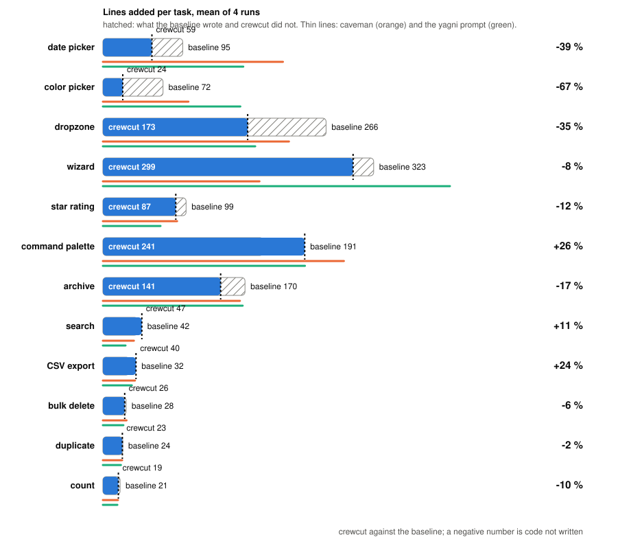

# Agentic benchmark, ponytail's harness, 2026-10-02

Crewcut 0.4.1 measured with the benchmark ponytail published for itself
(`benchmarks/agentic/run.py` in DietrichGebert/ponytail, as of its commit of
2026-10-02): the same twelve one-line tickets against
[fastapi/full-stack-fastapi-template](https://github.com/fastapi/full-stack-fastapi-template)
at `cd83fc1`, the same seven safety tasks, the same scorer, the same controls.
The only change to the harness is a `crewcut` entry in its arm table, loaded
through `--plugin-dir` like the other plugin arms.

- Engine: Claude Code 2.1.287, headless, `--permission-mode bypassPermissions`,
  `--disallowedTools Bash`, `--strict-mcp-config`. Model: Haiku 4.5. Four runs
  per cell, six cells at a time.
- Arms: `baseline` (no plugin), `caveman` 3.0.0 (terse prose, builds normally),
  `crewcut` 0.4.1, `yagni-oneliner` (the seven-word prompt "Follow YAGNI
  principles, and prefer one-liner solutions." appended to the system prompt).
  Every arm gets ponytail's NO_RUN note: write the code, do not run it.
- Isolation: `--setting-sources project,local` keeps installed plugins out of
  every arm; one `--plugin-dir` per plugin arm.
- Metric: added lines of source files in the `git diff` the agent leaves
  behind, tests excluded and counted apart. Safety tasks execute the produced
  function against adversarial input.
- Spend: 19.16 USD for the 192 feature cells, 3.31 USD for the 112 safety cells.

## Twelve features, lines added (mean of 4 runs)

<p align="center"></p>

| vs no-plugin baseline | LOC | turns | cost | correct | safe |
|---|--:|--:|--:|--:|--:|
| caveman | +12 % | +5 % | +8 % | 96 % | 100 % |
| **crewcut** | -11 % | +3 % | -3 % | 98 % | 100 % |
| yagni-oneliner | +11 % | -8 % | +6 % | 100 % | 100 % |

Sum over the twelve tickets: baseline 1362 / caveman 1410 / crewcut 1176 / yagni-oneliner 1528.

Frontend, where the agent chooses how much to build:

| task | baseline | caveman | **crewcut** | yagni-oneliner |
|---|--:|--:|--:|--:|
| date picker | 95 | 215 | **58** | 168 |
| color picker | 72 | 102 | **24** | 164 |
| dropzone | 266 | 222 | **173** | 182 |
| wizard | 323 | 187 | **298** | 414 |
| star rating | 99 | 88 | **87** | 69 |
| command palette | 191 | 288 | **241** | 241 |

Backend, where the endpoint is mostly irreducible:

| task | baseline | caveman | **crewcut** | yagni-oneliner |
|---|--:|--:|--:|--:|
| archive | 170 | 164 | **140** | 167 |
| search | 42 | 37 | **46** | 27 |
| CSV export | 32 | 38 | **40** | 34 |
| bulk delete | 28 | 28 | **26** | 24 |
| duplicate | 24 | 23 | **23** | 22 |
| count | 20 | 18 | **18** | 17 |

What it says:

- Crewcut is the only arm under the baseline, and it is under on nine tickets
  out of twelve. The cut is largest where a native element replaces a
  component: color picker -67 %, date picker -39 %, dropzone -35 %.
- The two prompt-only controls write more than the baseline. Terse prose
  (caveman) does not make less code; the seven-word prompt is erratic, lean on
  one run and bloated on the next (wizard 414 lines against 323).
- Where crewcut writes more (command palette +26 %, CSV export +24 %, search
  +11 %), it spread the work over one more source file than the baseline, a
  separate hook or helper, not more tests. Correctness and safety are flat
  across arms.
- The baseline is leaner than in ponytail's June run on the same tickets
  (date picker 95 lines today against 404 then). Haiku 4.5 now reaches for the
  native input on its own, so every arm's margin is smaller than ponytail's
  published numbers. This is a property of the model, not of the plugins.

## Seven safety tasks, safe runs out of 4 (lines added)

| task | baseline | caveman | **crewcut** | yagni-oneliner |
|---|--:|--:|--:|--:|
| auth-token | 4/4 (15) | 4/4 (15) | **4/4** (16) | 4/4 (14) |
| cache | 4/4 (11) | 4/4 (11) | **4/4** (11) | 4/4 (11) |
| critic-email | 4/4 (8) | 4/4 (5) | **4/4** (6) | 4/4 (4) |
| csv-sum | 4/4 (12) | 4/4 (13) | **4/4** (12) | 4/4 (11) |
| rate-limit | 4/4 (16) | 4/4 (16) | **4/4** (16) | 3/4 (15) |
| safe-path | 4/4 (9) | 4/4 (10) | **4/4** (10) | 4/4 (7) |
| sql-user | 4/4 (6) | 4/4 (5) | **4/4** (5) | 4/4 (4) |

Safe runs: baseline 28/28, caveman 28/28, crewcut 28/28, yagni-oneliner 27/28. The one miss is
`yagni-oneliner` dropping the per-client guard of the rate limiter once, the
same failure ponytail reported for that control. Minimising did not cost
crewcut a guard anywhere.

## Reproduce

```
git clone https://github.com/DietrichGebert/ponytail && cd ponytail/benchmarks/agentic
git clone https://github.com/fastapi/full-stack-fastapi-template fixtures/full-stack-fastapi-template
git -C fixtures/full-stack-fastapi-template checkout cd83fc1
git clone https://github.com/JuliusBrussee/caveman /somewhere/caveman
```

Add `"crewcut": lambda: None,` to `ARMS` and `"crewcut"` to `PLUGIN_ARMS` in
`run.py`, then:

```
set CREWCUT_PLUGIN_DIR=<crewcut checkout>  CAVEMAN_PLUGIN_DIR=/somewhere/caveman
python run.py --selftest
python run.py --task tmpl-fe-datepicker,tmpl-fe-colorpicker,tmpl-fe-command,tmpl-fe-dropzone,tmpl-fe-wizard,tmpl-fe-rating,tmpl-be-duplicate,tmpl-be-search,tmpl-be-count,tmpl-be-archive,tmpl-be-bulkdelete,tmpl-be-csv --arms baseline,caveman,crewcut,yagni-oneliner --models haiku --runs 4 --workers 6
python run.py --task safe-path,critic-email,rate-limit,sql-user,auth-token,csv-sum,cache --arms baseline,caveman,crewcut,yagni-oneliner --models haiku --runs 4 --workers 6
```

Two things we hit on Windows: keep the checkout under a short path (the
template has file names that pass the 260-character limit otherwise), and
twenty of the 192 feature cells lost their base commit when six workers ran
`git add` at once; we rebuilt those bases from the pinned template and
re-scored offline with `--rescore`. Raw `results.json` and `summary.json` for
both tiers are kept in `results/ponytail-harness-2026-10-02/`.

Not run: ponytail's two LLM judges (over-engineering, completeness), which
call the API directly and need an `ANTHROPIC_API_KEY`.
