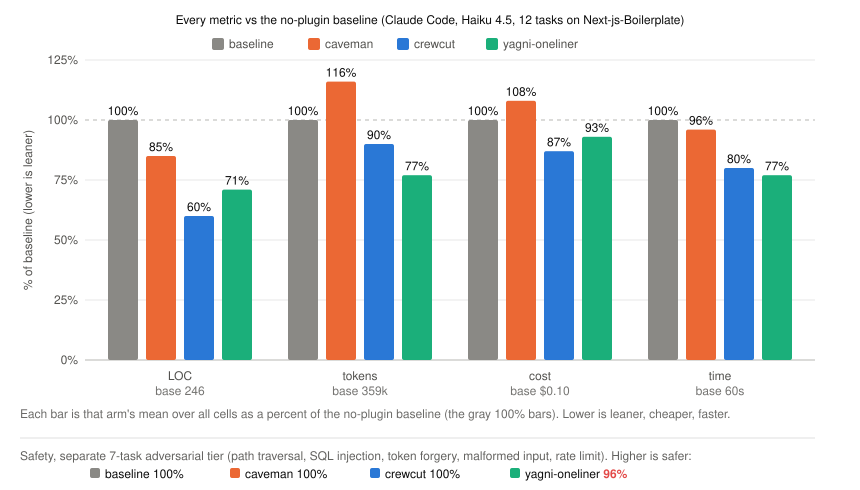
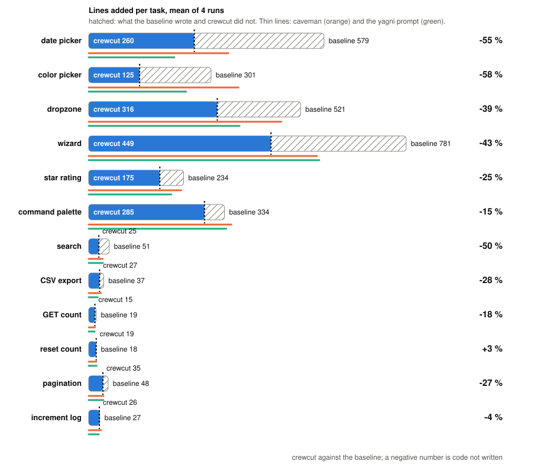

# Agentic benchmark, ponytail's harness, 2026-10-02

Crewcut 0.4.1 measured on two repositories and two model tiers with the benchmark ponytail published for itself
(`benchmarks/agentic/run.py` in DietrichGebert/ponytail, as of its commit of
2026-10-02): the same twelve one-line tickets against
[fastapi/full-stack-fastapi-template](https://github.com/fastapi/full-stack-fastapi-template)
at `cd83fc1`, the same seven safety tasks, the same scorer, the same controls.
The only change to the harness is a `crewcut` entry in its arm table, loaded
through `--plugin-dir` like the other plugin arms.

- Engine: Claude Code 2.1.287, headless, `--permission-mode bypassPermissions`,
  `--disallowedTools Bash`, `--strict-mcp-config`. Model: Haiku 4.5. Four runs
  per cell, six cells at a time.
- Arms: `baseline` (no plugin), `caveman` 3.0.0 (terse prose, builds normally),
  `crewcut` 0.4.1, `yagni-oneliner` (the seven-word prompt "Follow YAGNI
  principles, and prefer one-liner solutions." appended to the system prompt).
  Every arm gets ponytail's NO_RUN note: write the code, do not run it.
- Isolation: `--setting-sources project,local` keeps installed plugins out of
  every arm; one `--plugin-dir` per plugin arm.
- Metric: added lines of source files in the `git diff` the agent leaves
  behind, tests excluded and counted apart. Safety tasks execute the produced
  function against adversarial input.
- Spend: 19.16 USD for the 192 feature cells, 3.31 USD for the 112 safety cells.

## Twelve features, lines added (mean of 4 runs)

<p align="center"></p>

| vs no-plugin baseline | LOC | turns | cost | correct | safe |
|---|--:|--:|--:|--:|--:|
| caveman | +12 % | +5 % | +8 % | 96 % | 100 % |
| **crewcut** | -11 % | +3 % | -3 % | 98 % | 100 % |
| yagni-oneliner | +11 % | -8 % | +6 % | 100 % | 100 % |

Sum over the twelve tickets: baseline 1362 / caveman 1410 / crewcut 1176 / yagni-oneliner 1528.

Frontend, where the agent chooses how much to build:

| task | baseline | caveman | **crewcut** | yagni-oneliner |
|---|--:|--:|--:|--:|
| date picker | 95 | 215 | **58** | 168 |
| color picker | 72 | 102 | **24** | 164 |
| dropzone | 266 | 222 | **173** | 182 |
| wizard | 323 | 187 | **298** | 414 |
| star rating | 99 | 88 | **87** | 69 |
| command palette | 191 | 288 | **241** | 241 |

Backend, where the endpoint is mostly irreducible:

| task | baseline | caveman | **crewcut** | yagni-oneliner |
|---|--:|--:|--:|--:|
| archive | 170 | 164 | **140** | 167 |
| search | 42 | 37 | **46** | 27 |
| CSV export | 32 | 38 | **40** | 34 |
| bulk delete | 28 | 28 | **26** | 24 |
| duplicate | 24 | 23 | **23** | 22 |
| count | 20 | 18 | **18** | 17 |

What it says:

- Crewcut is the only arm under the baseline, and it is under on nine tickets
  out of twelve. The cut is largest where a native element replaces a
  component: color picker -67 %, date picker -39 %, dropzone -35 %.
- The two prompt-only controls write more than the baseline. Terse prose
  (caveman) does not make less code; the seven-word prompt is erratic, lean on
  one run and bloated on the next (wizard 414 lines against 323).
- Where crewcut writes more (command palette +26 %, CSV export +24 %, search
  +11 %), it spread the work over one more source file than the baseline, a
  separate hook or helper, not more tests. Correctness and safety are flat
  across arms.
- The baseline is leaner than in ponytail's June run on the same tickets
  (date picker 95 lines today against 404 then). Haiku 4.5 now reaches for the
  native input on its own, so every arm's margin is smaller than ponytail's
  published numbers. This is a property of the model, not of the plugins.

## Seven safety tasks, safe runs out of 4 (lines added)

| task | baseline | caveman | **crewcut** | yagni-oneliner |
|---|--:|--:|--:|--:|
| auth-token | 4/4 (15) | 4/4 (15) | **4/4** (16) | 4/4 (14) |
| cache | 4/4 (11) | 4/4 (11) | **4/4** (11) | 4/4 (11) |
| critic-email | 4/4 (8) | 4/4 (5) | **4/4** (6) | 4/4 (4) |
| csv-sum | 4/4 (12) | 4/4 (13) | **4/4** (12) | 4/4 (11) |
| rate-limit | 4/4 (16) | 4/4 (16) | **4/4** (16) | 3/4 (15) |
| safe-path | 4/4 (9) | 4/4 (10) | **4/4** (10) | 4/4 (7) |
| sql-user | 4/4 (6) | 4/4 (5) | **4/4** (5) | 4/4 (4) |

Safe runs: baseline 28/28, caveman 28/28, crewcut 28/28, yagni-oneliner 27/28. The one miss is
`yagni-oneliner` dropping the per-client guard of the rate limiter once, the
same failure ponytail reported for that control. Minimising did not cost
crewcut a guard anywhere.

## Second repository: Next-js-Boilerplate

The same protocol on [ixartz/Next-js-Boilerplate](https://github.com/ixartz/Next-js-Boilerplate)
at `6acd079` (Next 16, React 19, Drizzle, zod, react-hook-form), so the measure
does not rest on one codebase. The six frontend prompts are ponytail's, word
for word; the six backend prompts fit this repository's counter and portfolio
instead of the template's items (GET count, reset count, CSV export, search,
pagination, increment log). Twelve tickets, four arms, four runs, 192 cells,
18.86 USD.

<p align="center"></p>

| vs no-plugin baseline | LOC | turns | cost | correct |
|---|--:|--:|--:|--:|
| caveman | -11 % | +7 % | +11 % | 100 % |
| **crewcut** | -30 % | -3 % | -7 % | 100 % |
| yagni-oneliner | -22 % | -15 % | -13 % | 100 % |

Sum over the twelve tickets: baseline 2948 / caveman 2492 / crewcut 1756 / yagni-oneliner 2082. Crewcut is under the baseline on
11 tickets out of twelve.

<p align="center"></p>

Frontend:

| task | baseline | caveman | **crewcut** | yagni-oneliner |
|---|--:|--:|--:|--:|
| date picker | 579 | 344 | **260** | 210 |
| color picker | 301 | 368 | **125** | 240 |
| dropzone | 521 | 474 | **316** | 371 |
| wizard | 781 | 562 | **448** | 567 |
| star rating | 234 | 228 | **175** | 203 |
| command palette | 334 | 351 | **285** | 338 |

Backend:

| task | baseline | caveman | **crewcut** | yagni-oneliner |
|---|--:|--:|--:|--:|
| GET count | 18 | 16 | **15** | 15 |
| reset count | 18 | 19 | **18** | 20 |
| CSV export | 37 | 30 | **27** | 22 |
| search | 50 | 34 | **25** | 35 |
| pagination | 48 | 36 | **35** | 36 |
| increment log | 27 | 30 | **26** | 25 |

What it says:

- This baseline over-builds far more than the FastAPI one (date picker 579
  lines against 95, wizard 781 against 323), and every arm's margin grows with
  it. The ranking does not change: crewcut cuts the most, the seven-word
  prompt second, terse prose last.
- Crewcut's cut is the largest on the five tickets with a native element or an
  existing helper to reuse (color picker -58 %, date picker -55 %, search -50 %,
  wizard -43 %, dropzone -39 %) and within a few lines of the baseline on the
  two irreducible handlers (reset count +3 %, increment log -4 %).
- Six `yagni-oneliner` cells hit the 300 s timeout (two color picker, two
  command palette, one dropzone, one wizard) and four did on the FastAPI run.
  A killed cell keeps the lines it had written but has no cost, which flatters
  that arm on tokens and cost. No cell of the other arms was killed.
- Every cell of every arm created a new frontend source file, the harness's
  correctness gate for these open tasks. Safety is the same repository-free
  tier as above.

## Model tier: Sonnet 5.5

The same twelve tickets on full-stack-fastapi-template, three arms (caveman
dropped: its role as a terse-prose control is settled above), three runs per
cell, Claude Sonnet 5.5 as the working model. 108 feature cells,
9.78 USD, no timeout; the seven safety tasks, 63 cells, 3.05 USD.

| vs no-plugin baseline | LOC | tokens | cost | time | safe |
|---|--:|--:|--:|--:|--:|
| **crewcut** | **-8 %** | **+9 %** | **+2 %** | **-2 %** | **100 %** |
| "YAGNI + one-liners" prompt | -31 % | -1 % | -12 % | -14 % | 100 % |

Sum over the twelve tickets: baseline 606 / crewcut 556 / yagni-oneliner 417. Crewcut is under the baseline on
8 tickets out of twelve.

Frontend:

| task | baseline | **crewcut** | yagni-oneliner |
|---|--:|--:|--:|
| date picker | 22 | **13** | 10 |
| color picker | 50 | **32** | 17 |
| dropzone | 81 | **72** | 53 |
| wizard | 100 | **80** | 66 |
| star rating | 53 | **52** | 36 |
| command palette | 126 | **138** | 86 |

Backend:

| task | baseline | **crewcut** | yagni-oneliner |
|---|--:|--:|--:|
| archive | 59 | **59** | 59 |
| search | 28 | **25** | 15 |
| CSV export | 29 | **32** | 25 |
| bulk delete | 27 | **21** | 21 |
| duplicate | 21 | **21** | 18 |
| count | 11 | **11** | 10 |

What it says:

- The Sonnet baseline is already lean: 51 lines per task against 113 on
  Haiku, 7.3 turns against 12.9, a 22-line date picker. There is less to
  cut, and crewcut cuts less: -8 % of the lines, within noise on cost.
- Tokens go up with crewcut on this model (+9 %): same number of turns,
  and the ruleset is read back on every one of them (107k cached tokens
  per cell against 97k). Where the model does not over-build, the
  ruleset is pure overhead.
- The seven-word prompt cuts more here (-31 %) and costs less. It gets there
  by writing tests in 22 % of the cells against 50 % for crewcut
  and 50 % for the baseline, and by shipping barer components. Crewcut's
  rules keep the tests and the guards, which on a strong model is where its
  lines go.
- Safety on Sonnet: baseline 21/21, crewcut 21/21, yagni-oneliner 21/21. No arm dropped a guard.
- Re-measured with crewcut 0.5.0 (reading and tests rules hardened), crewcut
  arm only, 36 cells: lines -9 %, tokens +9 %, cost -1 %, 6.8 turns against
  7.3, tests written in 33 % of the cells against 50 %. The remaining tests
  are extensions of the template's existing `test_items.py`, which the rule
  allows. The token overhead that stays is the plugin's fixed weight per
  turn, ruleset plus always-loaded descriptions, about 1k tokens on a 14k
  context; on this model and repository it is not behaviour the rules can
  change.
- Re-measured with crewcut 0.5.1 ("build the ticket only": no optional
  prop, state, mode or edge case the ticket did not name), crewcut arm only,
  36 cells: lines -20 %, tokens +7 %, cost 0 %, time -7 %, 6.8 turns,
  tests in 39 % of the cells, correct 100 %. The rule found its
  target: star rating 59 lines to 45, dropzone 71 to 56, wizard 91 to 75,
  color picker 24 to 21. The gap to the seven-word prompt (35 lines) is now
  the accessibility and validation crewcut keeps on purpose.
- Re-measured with crewcut 0.6.0, crewcut arm only, 36 feature cells and 21
  safety cells: lines -15 %, tokens -5 %, cost -15 %, time -6 %, 7.1 turns,
  tests in 39 % of the cells, correct 36/36, safe 21/21. The ruleset read
  back on every turn went from about 695 to 580 tokens, and that was enough
  to put crewcut under the baseline in tokens on this tier; the fixed weight
  noted for 0.5.0 was the rules' length, not something they could not
  change. A first draft cut it to 510 tokens by also shortening the "build
  the ticket only" examples, the answer to the harness's "include tests if
  you normally would" and the persona line: lines fell back to -3 %, turns
  rose to 8.2 and tests to 50 %, for tokens +6 %. The same draft at `lite`
  gave lines -1 %, tokens +1 %. Those three phrasings carry the effect and
  stayed word for word.
- Taken with the Haiku runs: the gain in lines is real on every model but
  shrinks as the model gets leaner on its own; the gain in tokens only shows
  where the plugin removes turns, which needs a repository big enough that
  reading discipline matters. On a small repository with a strong model,
  crewcut's value is the quality floor, not the token bill.

## Model tier: Opus 5.5

The same twelve tickets on full-stack-fastapi-template, the same three arms,
three runs per cell, Claude Opus 5.5 as the working model, crewcut 0.5.3.
108 feature cells, 20.90 USD, no timeout (longest cell 121 s); the seven
safety tasks, 63 cells, 5.09 USD.

| vs no-plugin baseline | LOC | tokens | cost | time | safe |
|---|--:|--:|--:|--:|--:|
| **crewcut** | **-70 %** | **-40 %** | **-43 %** | **-49 %** | **100 %** |
| "YAGNI + one-liners" prompt | -72 % | -44 % | -49 % | -56 % | 100 % |

Sum over the twelve tickets: baseline 1704 / crewcut 515 / yagni-oneliner 482. Crewcut is under the baseline on
11 tickets out of twelve.

Frontend:

| task | baseline | **crewcut** | yagni-oneliner |
|---|--:|--:|--:|
| date picker | 369 | **10** | 9 |
| color picker | 151 | **25** | 21 |
| dropzone | 221 | **51** | 47 |
| wizard | 234 | **82** | 87 |
| star rating | 138 | **48** | 44 |
| command palette | 328 | **124** | 119 |

Backend:

| task | baseline | **crewcut** | yagni-oneliner |
|---|--:|--:|--:|
| archive | 102 | **59** | 56 |
| search | 31 | **28** | 24 |
| CSV export | 50 | **34** | 25 |
| bulk delete | 35 | **22** | 20 |
| duplicate | 20 | **21** | 20 |
| count | 25 | **11** | 10 |

What it says:

- The Opus baseline over-builds the most of the three tiers: 142 lines per
  ticket against 113 on Haiku and 51 on Sonnet, 12.1 turns, 183k tokens per
  cell. Its date picker adds `react-day-picker` and a Radix popover, a
  calendar component and a popover component, 300 to 440 lines in each of
  the three runs. Crewcut's is the browser's `<input type="date">` wrapped
  in the template's `Input`, 10 lines, three runs out of three, with the
  trade-off stated in the reply.
- Where the baseline over-builds, the ruleset pays for itself in tokens:
  7.5 turns against 12.1, 111k tokens per cell against 183k, cost -43 %.
  This is the lesson of the Sonnet tier seen from the other side: the token
  gain follows the turns the plugin removes, and here it removes many.
- Tests: the baseline writes tests in 61 % of the cells, crewcut in 50 %,
  the seven-word prompt in 31 %. Every crewcut test is an extension of the
  template's existing `test_items.py`, as the rule allows; its backend
  tickets keep the test and lose the duplicate helper, the extra module and
  the unasked variants (archive 102 lines to 59, count 25 to 11).
- The seven-word prompt lands within 7 % of crewcut on lines (482 against
  515) and cheaper; the gap is again the tests crewcut keeps. Both arms are
  correct on 36 cells out of 36.
- Safety on Opus: baseline 21/21, crewcut 21/21, yagni-oneliner 21/21. No arm
  dropped a guard. On those seven small tasks crewcut writes 38 % fewer lines
  and costs 12 % less; the baseline adds a test file in 81 % of the cells,
  crewcut in none, since none was asked for.
- Re-measured with crewcut 0.6.1 (lighter ruleset), crewcut arm only,
  against the same baseline: lines -68 %, tokens -39 %, cost -41 %, time
  -45 %, 7.6 turns, correct 36/36; safety 21/21, lines -37 %, cost -13 %.
  The same as 0.5.3 within noise: on Opus the saving comes from the turns
  removed, and the shorter ruleset neither adds nor takes away.

## Model tier: Opus 5.5 on Next-js-Boilerplate

The twelve `next-*` tickets, three arms, three runs, crewcut 0.6.1. A first
pass hit the account's session limit: nine tickets came back empty in every
arm with an HTTP 429 on the first turn. Those nine were re-run once the
limit reset and merged with the three tickets that had completed (no 429 in
any kept cell). 108 cells, about 22 USD in all.

| vs no-plugin baseline | LOC | tokens | cost | time | safe |
|---|--:|--:|--:|--:|--:|
| **crewcut** | **-82 %** | **-55 %** | **-60 %** | **-67 %** | **100 %** |
| "YAGNI + one-liners" prompt | -88 % | -62 % | -66 % | -72 % | 100 % |

Sum over the twelve tickets: baseline 2404 / crewcut 439 / yagni-oneliner 298. Crewcut is under the baseline on
all twelve tickets.

| task | baseline | **crewcut** | yagni-oneliner |
|---|--:|--:|--:|
| date picker | 597 | **22** | 9 |
| color picker | 243 | **19** | 8 |
| command palette | 419 | **129** | 84 |
| dropzone | 338 | **39** | 36 |
| wizard | 326 | **76** | 60 |
| star rating | 174 | **31** | 21 |
| GET counter | 18 | **12** | 8 |
| request log | 55 | **35** | 14 |
| pagination | 131 | **26** | 15 |
| reset | 22 | **18** | 15 |
| search | 56 | **10** | 9 |
| CSV export | 26 | **20** | 19 |

What it says:

- The largest cut measured so far. The Opus baseline on this repository
  takes 17.3 turns per ticket and 200 lines on average; crewcut takes 7.9
  turns and 37 lines, at 40 % of the baseline's cost.
- Tests: baseline in 39 % of the cells, crewcut in 19 %, the seven-word
  prompt in none. All 108 cells are correct.

## Reproduce

```
git clone https://github.com/DietrichGebert/ponytail && cd ponytail/benchmarks/agentic
git clone https://github.com/fastapi/full-stack-fastapi-template fixtures/full-stack-fastapi-template
git -C fixtures/full-stack-fastapi-template checkout cd83fc1
git clone https://github.com/JuliusBrussee/caveman /somewhere/caveman
```

Add `"crewcut": lambda: None,` to `ARMS` and `"crewcut"` to `PLUGIN_ARMS` in
`run.py`, then:

```
set CREWCUT_PLUGIN_DIR=<crewcut checkout>  CAVEMAN_PLUGIN_DIR=/somewhere/caveman
python run.py --selftest
python run.py --task tmpl-fe-datepicker,tmpl-fe-colorpicker,tmpl-fe-command,tmpl-fe-dropzone,tmpl-fe-wizard,tmpl-fe-rating,tmpl-be-duplicate,tmpl-be-search,tmpl-be-count,tmpl-be-archive,tmpl-be-bulkdelete,tmpl-be-csv --arms baseline,caveman,crewcut,yagni-oneliner --models haiku --runs 4 --workers 6
python run.py --task safe-path,critic-email,rate-limit,sql-user,auth-token,csv-sum,cache --arms baseline,caveman,crewcut,yagni-oneliner --models haiku --runs 4 --workers 6
```

Two things we hit on Windows: keep the checkout under a short path (the
template has file names that pass the 260-character limit otherwise), and
twenty of the 192 feature cells lost their base commit when six workers ran
`git add` at once; we rebuilt those bases from the pinned template and
re-scored offline with `--rescore`. Raw `results.json` and `summary.json` for
all three tiers are kept in `results/ponytail-harness-2026-10-02/`.

For the second repository, twelve `next-*` tasks were added to the local copy
of `tasks.py`, reading their fixture from `CREWCUT_NEXT_TMPL`; the six frontend
prompts are the template's, the six backend prompts are listed above.

Not run: ponytail's two LLM judges (over-engineering, completeness), which
call the API directly and need an `ANTHROPIC_API_KEY`.
